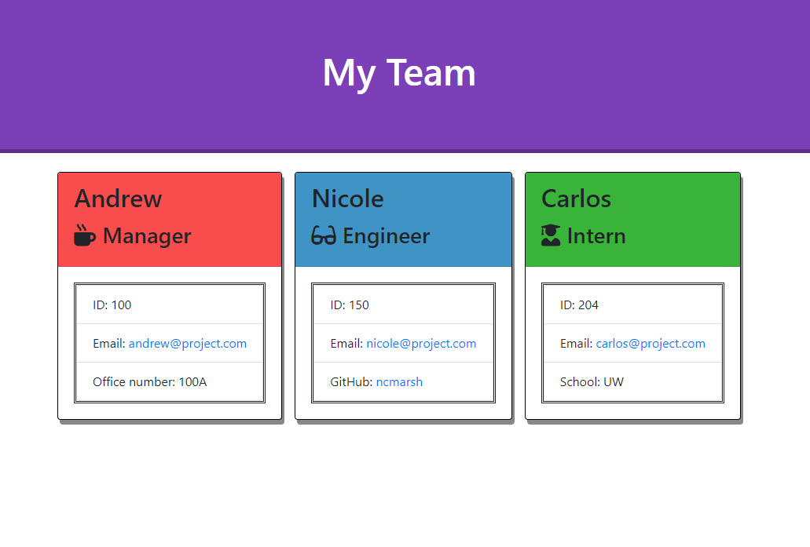

# Software Engineering Team Generator

Keep your team's information handy and organized using this easy-to-use Software Engineering Team Generator!

## Table of Contents

1. [Usage](#Usage)
1. [Languages and Concepts](#Languages-and-Concepts)
1. [Installation](#Installation)
1. [Demo](#Demo)
1. [Method](#Method)
1. [Roadmap](#Roadmap)
1. [Links](#Links)
1. [Contact](#Contact)
1. [Contributing](#Contributing)
1. [License](#License)
1. [Test](#Test)

## Usage

This command line application is designed to help you create a team directory and keep your team's information easy to access and all in one location. You have the ability to enter your information along with your team's and have it available all on one page. All you need to do is follow the prompts!

## Languages and Concepts

- JavaScript
- Node.js
- Inquirer.js
- Bootstrap
- Font Awesome

## Installation

Follow these steps to get started:

After cloning the repository to your local computer, you'll want to install Node.js and the dependencies (inquirer) needed to run this application. You can do this by running:

    $ npm init
    $ npm install

Then to start the program, you'll run:

    $ node app.js

Once you're finished, you'll find your generated HTML page and its accompanying stylesheet in the following folder:

    ./output/team.html
    ./output/style.css

## Demo

[Click to view full demo](https://youtu.be/CNFqOki0PWo)

## Method

To begin this project, I first created my files, including a .gitignore, and ran:

    $ npm init
    $ npm install inquirer

These prompts establish the npm inquirer package. 

Next, I created an Employee parent class with constructor parameters of the shared properties: name, id and email along with methods getName, getId, getEmail and getRole. Once I got this code passing the tests, I created the Manager class that extends from the Employee class and added the Manager-specific method: getOfficeNumber. Testing along the way, I then did the same for the Engineer and Intern class, adding their role-specific methods respectively: getGithub and getSchool. One final test: Passing!

Now that my classes were established, it was time to create my inquirer prompts in app.js. Knowing I had a few different routes of questions that could be needed, I decided to build seperate question arrays for each situation. I first began by creating the initial questions to set up the manager. Then I made an array for the multiple choice question that will determine which employee the user wants to add next. Then an array for the engineer questions and for the intern questions. Once my questions were made, I created a function to call the initial manager questions and tested.

To keep my code clean and easy to read, I next decided to also make separate functions for each of the question arrays: nextRole(), runEngineer(), and runIntern().

Not wanting to have too many nested functions, I decided to have the initial inquirer prompt call the starting array for the manager and in the .then, it would call the nextRole(), which will prompt the multiple choice question about who they want to make next. Within the nextRole() function, I added an if/else statement, so depending on what the user selects, it will prompt that next array of questions. 

Then I added an empty array for the responses to be added to and added .push statements to push the response into the array for each employee type as the user continues through. 

Now that I have an array of employees being created by the user, I added prior to pushing to the array, for it to create a new instance of the type of employee being added from my classes I previously made.

With an array of employees, the next step was to have this information display through the html template. I created a writeFile function to create the output folder and render the HTML here for the user.

My next step is to add some validation code to the inquirer prompts to ensure the user is entering the correct type of information. My validation tests I included were to verify the id number wasn't already taken, to verify the input isn't blank and to verify the email is in the correct email format. For the checkEmail() function, after some research, I found a regular expression on [w3resource.com](https://www.w3resource.com/javascript/form/email-validation.php) that can be used to check that the input matches the email format.

My last step was to refine the CSS so it looks a little more stylized. And in order for the styling to stick with the user, I added a fs.copyFile() method to copy the css file into the output folder when rendering the HTML.

## Roadmap

To further this project, I would like to add a couple features to the inquirer prompts. First I would like to add a confirmation of a user once they are added: to show the finished information and if it's correct, then it'll add and if not, they can go back and resubmit. I would also like to add a feature to add additional people or edit existing people or add additional role types. A smaller detail that would be nice to add is to display the person's name in the questions as they are being created: "What's your engineer's name?" - Cooper. Then it'll go on and say "What is Cooper's id?" and so on. To personalize it more, it would be fun to add in a personal question like, "What's this person's favorite animal?" And then using that information, it could either generate an icon or a gif to go with their individual card.

## Links

- [Project Repository](https://github.com/ncmarsh/software_engineering_team_generator)
- [View the demo](https://youtu.be/CNFqOki0PWo)

## Contact

- Nicole Marshall - [@ncmarsh](https://github.com/ncmarsh)

## Contributing

This is a personal project; no contributions are required at this time.

## License

No license granted.

## Test

    $ npm run test

##### [Return to Top of Page](#Software-Engineering-Team-Generator)